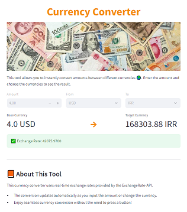

# Currency Converter with Streamlit

This is a simple currency converter application built using Streamlit. 
It allows users to convert between different currencies using real-time exchange rates.

## Features

- Select the base currency and the target currency from a dropdown menu.
- Enter the amount to be converted.
- View the exchange rate used for the conversion.

## Installation

To run this application, you need to have Python 3.6 or later installed on your machine. Follow these steps to set up the application:

1. Clone this repository to your local machine.
2. Open a terminal and navigate to the project directory.
3. Create a virtual environment (optional but recommended).
4. Install the required dependencies by running the following command:

pip install -r requirements.txt

## Usage

To start the application, run the following command in your terminal:

streamlit run app.py

This will start a local server and open the application in your default web browser.

## Dependencies

The following Python packages are used in this application:

- Streamlit: A powerful framework for building interactive web applications with Python.
- Requests: A library for making HTTP requests in Python.
- Pandas: A data manipulation and analysis library.

These dependencies are listed in the requirements.txt file and will be installed automatically when running the installation command mentioned above.

## Data Source

This application uses exchange rate data from [ExchangeRate-API](https://www.exchangerate-api.com/). You will need to sign up for a free API key and replace the placeholder in the app.py file with your own key.

## License

This project is licensed under the MIT License. Feel free to modify and use it according to your needs.

## Acknowledgements

- Streamlit: [https://www.streamlit.io/](https://www.streamlit.io/)
- ExchangeRate-API: [https://www.exchangerate-api.com/](https://www.exchangerate-api.com/)